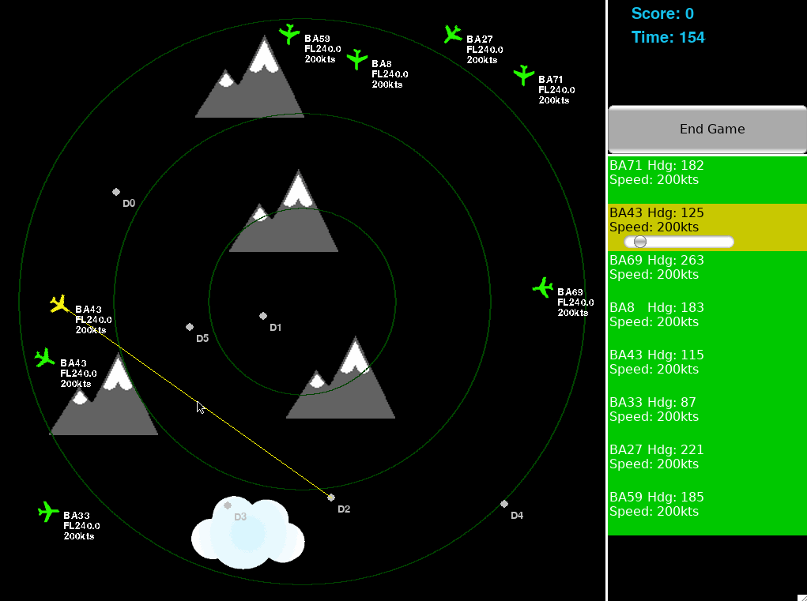

# air-traffic-control-AI
An AI that plays an air traffic simulator, routing randomly generated planes to their destinations while avoiding collisions with each other and environmental obstacles.

The game is `python-air-traffic-control`, a python implementation of the above scenario. You can find its original repo [here.](https://github.com/scotty3785/python-air-traffic-control). I'm playing it in the gif below.

## How to Install
1. Clone this repository to your desired location.
2. `cd` into the repo.
3. Run `git submodule init`. This initializes your local .gitmodules configuration file.
4. Run `git submodule update`. This downloads the repos this project depends on (as of 10/4/19, only `python-air-traffic-control`)
5. Create a Python 3 virtual environment using `virtualenv` or `virtualenvwrapper` and activate it.
6. Run `pip install -r requirements.txt` to download all of the necessary dependencies.

## How to play the game on your own
1. Make sure your virtual environment described in 'How to Install' is activated.
2. `cd` into the `python-air-traffic-control` directory.
3. Run `python main.py`.
